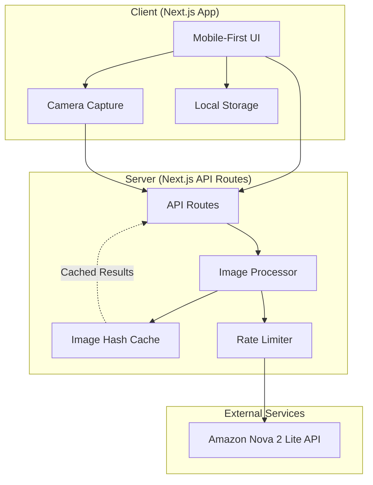

<!-- generatedBy: brain:sync-github; source: https://github.com/uset82/cookthis-/blob/main/.kiro/specs/cookthis/design.md; checkedOn: 2026-07-31; redactions: 0 -->

# COOKTHIS Design Document

## Overview

COOKTHIS is a mobile-first web application built with Next.js that helps students decide what to cook by analyzing photos of their fridge and pantry contents. The application leverages Amazon Nova 2 Lite for AI-powered ingredient extraction from images and intelligent meal suggestion generation based on available ingredients and user preferences.

The system follows a three-phase user flow:
1. **Onboarding**: Capture dietary preferences, allergies, cooking constraints, and budget
2. **Ingredient Capture**: Photo scanning with AI extraction and manual editing
3. **Meal Discovery**: AI-generated meal suggestions with interaction options and shopping list generation

## Architecture



### Architecture Decisions

1. **Next.js Full-Stack**: Single codebase for frontend and API routes, simplifying deployment and development
2. **Server-Side API Key**: Nova API key stored only in server environment variables for security
3. **Image Hash Caching**: SHA-256 hash of images to detect duplicates and reuse extraction results
4. **Local Storage for Preferences**: User preferences stored client-side to reduce server complexity
5. **Temporary Image Storage**: Images deleted immediately after processing to protect privacy

## Components and Interfaces

### Frontend Components

```
src/
??? app/
?   ??? page.tsx                    # Landing/home page
?   ??? onboarding/
?   ?   ??? page.tsx                # Onboarding flow
?   ??? scan/
?   ?   ??? fridge/page.tsx         # Fridge photo capture
?   ?   ??? pantry/page.tsx         # Pantry photo capture
?   ??? ingredients/
?   ?   ??? page.tsx                # Ingredient review/edit
?   ??? meals/
?   ?   ??? page.tsx                # Meal suggestions list
?   ?   ??? [id]/page.tsx           # Meal detail view
?   ??? shopping/
?       ??? page.tsx                # Shopping list
??? components/
?   ??? ui/                         # Reusable UI components
?   ??? onboarding/                 # Onboarding step components
?   ??? camera/                     # Camera capture component
?   ??? ingredients/                # Ingredient list components
?   ??? meals/                      # Meal card components
?   ??? shopping/                   # Shopping list components
??? lib/
?   ??? api.ts                      # API client functions
?   ??? storage.ts                  # Local storage utilities
?   ??? types.ts                    # TypeScript type definitions
?   ??? validation.ts               # Data validation functions
??? hooks/
    ??? usePreferences.ts           # User preferences hook
    ??? useIngredients.ts           # Ingredient state hook
    ??? useMeals.ts                 # Meal suggestions hook
```

### API Routes

```
src/app/api/
??? extract/
?   ??? route.ts                    # POST: Extract ingredients from images
??? meals/
?   ??? route.ts                    # POST: Generate meal suggestions
??? health/
    ??? route.ts                    # GET: Health check endpoint
```

### Core Interfaces

```typescript
// User Preferences
interface UserPreferences {
  dietaryPreference: 'omnivore' | 'vegetarian' | 'vegan' | 'pescatarian';
  allergies: string[];
  maxCookTime: 10 | 20 | 30;
  skillLevel: 'beginner' | 'intermediate';
  appliances: string[];
  budget: 'ultra-cheap' | 'normal' | 'treat';
}

// Ingredient from Nova API
interface DetectedIngredient {
  name: string;
  category: 'produce' | 'dairy' | 'meat' | 'condiment' | 'grain' | 'frozen' | 'snack' | 'other';
  quantityGuess?: string;
  confidence: number;
  evidence: string;
}

// Ingredient Extraction Response
interface IngredientExtractionResponse {
  detectedItems: DetectedIngredient[];
  notes: string[];
}

// User's Ingredient (after editing)
interface UserIngredient {
  id: string;
  name: string;
  category: string;
  quantityGuess?: string;
  mustUseSoon: boolean;
  source: 'ai' | 'manual';
}

// Meal Substitution
interface Substitution {
  missing: string;
  swap: string;
  note: string;
}

// Generated Meal
interface Meal {
  id: string;
  title: string;
  whyItMatches: string;
  timeMinutes: number;
  difficulty: 1 | 2 | 3 | 4 | 5;
  ingredientsHave: string[];
  ingredientsNeed: string[];
  substitutions: Substitution[];
  steps: string[];
  studentHacks: string[];
  leftoverTip: string;
}

// Meal Generation Response
interface MealGenerationResponse {
  meals: Meal[];
  safetyNotes: string[];
}
```

## Data Models

### Local Storage Schema

```typescript
// Stored in localStorage
interface StoredData {
  preferences: UserPreferences | null;
  ingredients: UserIngredient[];
  selectedMeals: string[];  // Meal IDs
  imageHashes: Record<string, string>;  // hash -> cached result key
}
```

### API Request/Response Schemas

#### Ingredient Extraction Request
```typescript
interface ExtractRequest {
  images: string[];  // Base64 encoded images
}
```

#### Ingredient Extraction Response (from Nova)
```json
{
  "detected_items": [
    {
      "name": "string",
      "category": "produce|dairy|meat|condiment|grain|frozen|snack|other",
      "quantity_guess": "string (optional)",
      "confidence": 0.0,
      "evidence": "string"
    }
  ],
  "notes": ["string"]
}
```

#### Meal Generation Request
```typescript
interface MealGenerationRequest {
  ingredients: string[];  // Normalized ingredient names
  preferences: UserPreferences;
}
```

#### Meal Generation Response (from Nova)
```json
{
  "meals": [
    {
      "title": "string",
      "why_it_matches": "string",
      "time_minutes": 0,
      "difficulty": 1,
      "ingredients_have": ["string"],
      "ingredients_need": ["string"],
      "substitutions": [
        {"missing": "string", "swap": "string", "note": "string"}
      ],
      "steps": ["string"],
      "student_hacks": ["string"],
      "leftover_tip": "string"
    }
  ],
  "safety_notes": ["string"]
}
```

### Data Transformation Pipeline


## Correctness Properties

*A property is a characteristic or behavior that should hold true across all valid executions of a system-essentially, a formal statement about what the system should do. Properties serve as the bridge between human-readable specifications and machine-verifiable correctness guarantees.*

Based on the acceptance criteria analysis, the following correctness properties must be validated through property-based testing:

### Property 1: User Preferences Round-Trip Consistency
*For any* valid UserPreferences object, serializing to JSON and then parsing back SHALL produce an equivalent UserPreferences object.
**Validates: Requirements 1.5, 11.5**

### Property 2: Ingredient Data Round-Trip Consistency
*For any* valid UserIngredient array, serializing to JSON for local storage and then parsing back SHALL produce an equivalent array with all fields preserved.
**Validates: Requirements 11.5**

### Property 3: Meal Data Round-Trip Consistency
*For any* valid Meal array, serializing to JSON and then parsing back SHALL produce an equivalent array with all fields preserved.
**Validates: Requirements 11.6**

### Property 4: Ingredient Extraction Response Parsing
*For any* valid Nova API ingredient extraction response JSON, parsing SHALL produce a correctly typed IngredientExtractionResponse with all detected items containing name, category, confidence, and evidence fields.
**Validates: Requirements 2.4, 7.2, 7.3, 11.1**

### Property 5: Meal Generation Response Parsing
*For any* valid Nova API meal generation response JSON, parsing SHALL produce a correctly typed MealGenerationResponse with all meals containing required fields (title, timeMinutes, difficulty, ingredientsHave, ingredientsNeed, steps).
**Validates: Requirements 4.2, 8.2, 8.3, 11.2**

### Property 6: Ingredient Name Normalization Idempotence
*For any* ingredient name string, normalizing it twice SHALL produce the same result as normalizing it once (idempotent operation).
**Validates: Requirements 3.3**

### Property 7: Ingredient List Modification Persistence
*For any* ingredient list and any valid modification (add, remove, or update), the stored ingredient list SHALL reflect that modification immediately after the operation.
**Validates: Requirements 3.5**

### Property 8: Meal Ranking Consistency
*For any* set of meals with the same user preferences, the ranking function SHALL produce a consistent ordering where meals with fewer missing ingredients rank higher than meals with more missing ingredients.
**Validates: Requirements 4.3**

### Property 9: Meal Card Rendering Completeness
*For any* valid Meal object, the rendered meal card output SHALL contain the title, time estimate, difficulty rating, ingredients have list, ingredients need list, and steps.
**Validates: Requirements 4.4**

### Property 10: Shopping List Consolidation
*For any* set of selected meals, the generated shopping list SHALL contain all unique missing ingredients from all selected meals with no duplicates.
**Validates: Requirements 6.1, 6.2**

### Property 11: Shopping List Category Grouping
*For any* shopping list with items from multiple categories, the grouped output SHALL organize all items by their category with no items appearing in incorrect categories.
**Validates: Requirements 6.3**

### Property 12: Ingredient Deduplication Across Images
*For any* set of ingredient lists from multiple images, deduplication SHALL produce a list where no two ingredients have the same normalized name.
**Validates: Requirements 7.5**

### Property 13: Image Hash Caching Consistency
*For any* image, computing the hash multiple times SHALL produce the same hash value, and uploading the same image twice SHALL return cached results on the second upload.
**Validates: Requirements 9.3, 9.4**

### Property 14: Rate Limiting Enforcement
*For any* sequence of API requests exceeding the rate limit threshold, the system SHALL reject requests beyond the limit until the rate limit window resets.
**Validates: Requirements 10.2**

## Error Handling

### Client-Side Errors

| Error Type | Handling Strategy |
|------------|-------------------|
| Camera access denied | Display permission request with instructions |
| No images captured | Disable "Continue" button, show helper text |
| Local storage full | Show warning, offer to clear old data |
| Network offline | Show offline indicator, queue requests |

### Server-Side Errors

| Error Type | HTTP Status | User Message |
|------------|-------------|--------------|
| Invalid image format | 400 | "Please upload a valid image (JPG, PNG)" |
| Image too large | 413 | "Image is too large. Please use a smaller image." |
| Nova API error | 502 | "AI service temporarily unavailable. Please try again." |
| Rate limit exceeded | 429 | "Too many requests. Please wait a moment." |
| Invalid JSON response | 500 | "Something went wrong. Please try again." |

### Nova API Error Recovery

```typescript
async function callNovaWithRetry(request: NovaRequest, maxRetries = 2): Promise<NovaResponse> {
  for (let attempt = 0; attempt <= maxRetries; attempt++) {
    try {
      const response = await callNovaAPI(request);
      return validateAndParse(response);
    } catch (error) {
      if (attempt === maxRetries) throw error;
      await delay(1000 * (attempt + 1)); // Exponential backoff
    }
  }
}
```

## Testing Strategy

### Testing Framework

- **Unit Testing**: Vitest for fast, TypeScript-native testing
- **Property-Based Testing**: fast-check library for generating random test inputs
- **Component Testing**: React Testing Library for UI components
- **E2E Testing**: Playwright for critical user flows (optional)

### Dual Testing Approach

The testing strategy employs both unit tests and property-based tests as complementary approaches:

- **Unit tests** verify specific examples, edge cases, and integration points
- **Property-based tests** verify universal properties that should hold across all valid inputs

### Unit Test Coverage

| Component | Test Focus |
|-----------|------------|
| Onboarding Flow | Step transitions, preference persistence |
| Camera Capture | Image capture limits, format validation |
| Ingredient Editor | Add/remove/edit operations |
| Meal Cards | Rendering with various data states |
| Shopping List | Item grouping, check-off functionality |
| API Routes | Request validation, error responses |

### Property-Based Test Requirements

Each correctness property from the design document SHALL be implemented as a property-based test using fast-check. Tests SHALL:

1. Run a minimum of 100 iterations per property
2. Include a comment referencing the correctness property: `**Feature: cookthis, Property {N}: {description}**`
3. Use smart generators that constrain inputs to valid domain values
4. Test edge cases through shrinking when failures are found

### Property Test Examples

```typescript
// Example: Property 2 - Ingredient Data Round-Trip
// **Feature: cookthis, Property 2: Ingredient Data Round-Trip Consistency**
test('ingredient data survives round-trip serialization', () => {
  fc.assert(
    fc.property(ingredientArrayArbitrary, (ingredients) => {
      const serialized = JSON.stringify(ingredients);
      const parsed = parseIngredients(serialized);
      return deepEqual(ingredients, parsed);
    }),
    { numRuns: 100 }
  );
});

// Example: Property 12 - Deduplication
// **Feature: cookthis, Property 12: Ingredient Deduplication Across Images**
test('deduplication removes all duplicate ingredient names', () => {
  fc.assert(
    fc.property(fc.array(ingredientListArbitrary), (ingredientLists) => {
      const deduplicated = deduplicateIngredients(ingredientLists.flat());
      const names = deduplicated.map(i => i.name.toLowerCase());
      return new Set(names).size === names.length;
    }),
    { numRuns: 100 }
  );
});
```

### Test File Organization

```
src/
??? lib/
?   ??? validation.ts
?   ??? validation.test.ts          # Unit tests
?   ??? validation.property.test.ts # Property tests
??? components/
?   ??? MealCard.tsx
?   ??? MealCard.test.tsx           # Component tests
??? app/api/
    ??? extract/route.ts
    ??? extract/route.test.ts       # API route tests
```

### Test Data Generators (fast-check Arbitraries)

```typescript
// Ingredient generator
const ingredientArbitrary = fc.record({
  id: fc.uuid(),
  name: fc.string({ minLength: 1, maxLength: 50 }),
  category: fc.constantFrom('produce', 'dairy', 'meat', 'condiment', 'grain', 'frozen', 'snack', 'other'),
  quantityGuess: fc.option(fc.string({ maxLength: 20 })),
  mustUseSoon: fc.boolean(),
  source: fc.constantFrom('ai', 'manual')
});

// Meal generator
const mealArbitrary = fc.record({
  id: fc.uuid(),
  title: fc.string({ minLength: 1, maxLength: 100 }),
  whyItMatches: fc.string({ maxLength: 200 }),
  timeMinutes: fc.integer({ min: 5, max: 60 }),
  difficulty: fc.integer({ min: 1, max: 5 }) as fc.Arbitrary<1|2|3|4|5>,
  ingredientsHave: fc.array(fc.string({ minLength: 1 }), { minLength: 1, maxLength: 10 }),
  ingredientsNeed: fc.array(fc.string({ minLength: 1 }), { maxLength: 5 }),
  substitutions: fc.array(substitutionArbitrary, { maxLength: 3 }),
  steps: fc.array(fc.string({ minLength: 1 }), { minLength: 5, maxLength: 9 }),
  studentHacks: fc.array(fc.string(), { maxLength: 3 }),
  leftoverTip: fc.string({ maxLength: 100 })
});
```
