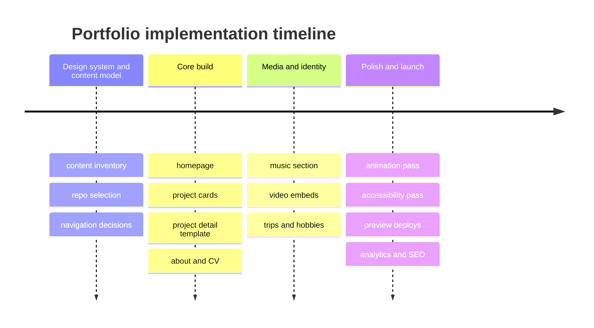
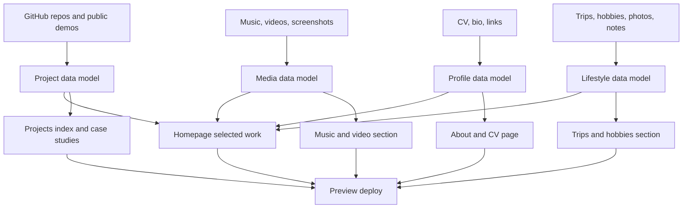

# Modern Personal Portfolio Site Research

## Executive Summary

Your public GitHub footprint already contains the raw ingredients for a strong, modern portfolio: a relatively broad body of work across 60 public repositories, visible activity in TypeScript-heavy projects, and several repos that naturally map to distinct portfolio “tracks” such as creative tooling, AI/devtools, community/location apps, and music interfaces. The clearest flagship candidates are **StrudelAI** for music and multimedia, **avatar-studio** for animated/interactive tooling, **iFoundYou** for product/system thinking, and **OpenNemoClaw** plus **webdesigner** for AI-agent infrastructure and design orchestration. That mix is unusually rich for a personal site because it supports both technical credibility and personality-driven storytelling. citeturn26view0turn27view0turn29view1turn29view2turn29view3turn30view0

For your brief, the best-performing direction is **not** a plain developer portfolio. It should be a **hybrid editorial portfolio**: a clean project-led structure for apps and case studies, plus dedicated modules for **video, music, CV, travel, and hobbies**. Your own repos already suggest that this will feel authentic rather than decorative, because your work spans creative interfaces, audio tooling, AI systems, and product concepts. The strongest visual influences in current portfolio practice are editorial typography, restrained color systems, cinematic hero moments, modular case-study cards, and richer media sections that remain secondary to information architecture. Refero Styles is useful here less as a “template” source and more as a searchable corpus of design systems and DESIGN.md guidance for AI-assisted implementation. citeturn42view0turn32search9turn34view0turn35search12turn35search13

From a build perspective, there are three realistic directions. If you want the best ratio of speed, maintainability, and performance for a content-rich portfolio, **Astro + content collections + selective React islands** is the best fit. If you expect a long-term modular CMS and richer interactive editorial workflows, **Next.js App Router + Sanity** is the stronger scaling option. If you want the lightest-feeling interaction model and highly custom motion, **SvelteKit** is the alternative worth considering. For hosting, both **Netlify** and **Canner** are viable given your ecosystem; Netlify is stronger for mature preview/review collaboration, while Canner is notable for Quebec-hosted infrastructure, branch previews, managed services, and its explicit support for frameworks like Next.js, Astro, React, Vite, Svelte, and Remix. citeturn37search0turn37search11turn37search17turn38search0turn39search0turn39search2turn40search0turn40search1turn40search2turn40search4turn40search6

The most important practical finding from the link audit is that your **public GitHub is highly reusable**, while the **Netlify team projects page is not meaningfully auditable without JavaScript/dashboard access** and the **Canner dashboard requires authentication**. Even so, your public repo metadata already exposes at least one useful public deployment path: **StrudelAI** lists live demos on both a Canner subdomain and Netlify. That means the portfolio can safely treat GitHub as the source of truth for project metadata and use deployment platforms primarily as runtime/demo targets. citeturn31view0turn31view1turn30view0

## Audit of Your Existing Footprint

Your GitHub profile indicates **60 repositories**, **14 starred repos**, and a public profile with several visible “popular repos,” including **StrudelAI**, **iFoundYou**, **opennemoclaw**, **Tetris**, and your profile config repo. On the repositories tab, GitHub surfaces recent activity in projects such as **avatar-studio** updated July 14, 2026, **mentora** July 5, 2026, **webdesigner** June 26, 2026, **StrudelAI** June 21, 2026, and **iFoundYou** May 14, 2026. That activity pattern suggests your portfolio should emphasize **fresh work, process, and shipping velocity**, not just static “best of” thumbnails. citeturn24view0turn26view0

A second important signal is thematic coherence. Even though the repos vary, they cluster into four clear narratives: **creative/audio systems** by way of StrudelAI; **interactive/animated tooling** through avatar-studio; **social/location/community product concepts** through iFoundYou; and **AI/devtool frameworks** through OpenNemoClaw and webdesigner. That is enough to build a portfolio with real editorial structure: “Build,” “Create,” “Explore,” and “About.” citeturn27view0turn29view1turn29view2turn29view3turn30view0

A constraint that matters for asset reuse: **avatar-studio** explicitly says the public repo and VSIX **do not include** certain local artworks, `.blend` files, GLB files, or workspace previews used during development. By contrast, **StrudelAI** visibly includes `images`, `public`, `training_data`, and voice/audio-related materials, and its README advertises live demos plus extensive feature modules. That means StrudelAI is suitable as a **media-rich flagship case study**, while avatar-studio is better positioned as a **process and engineering case study** unless you externally curate replacement visuals. citeturn27view0turn30view0

The Netlify and Canner dashboard links, as provided, are not directly auditable as content sources in a reliable way: the Netlify dashboard page only resolves to a JavaScript-required shell in this environment, and the Canner dashboard resolves to a sign-in page. Therefore, the most dependable reuseable inventory is public GitHub content plus public live demos disclosed in READMEs. citeturn31view0turn31view1turn30view0

### Reusable assets and narratives from your public repos

| Repo | What it currently exposes publicly | Best portfolio role | Reuse guidance | Source |
|---|---|---|---|---|
| **StrudelAI** | Live demos on Canner and Netlify; images/public assets; training and voice/audio modules; YouTube-to-Strudel, DJ mixer, MusicGen, waveform/audio features in README | **Flagship multimedia case study** | Put this first or second in Projects; add video/audio embeds, screenshots, architecture notes, and a “what I learned” section | citeturn30view0 |
| **avatar-studio** | VS Code/Cursor animated assistant extension; SVG/PixiJS/Three.js rendering; package/release flow; explicit note that certain private art/GLB assets are not in the public repo | **Interactive tools case study** | Emphasize architecture, extension UX, local-only security model, and motion states; use redistributable visuals only | citeturn27view0 |
| **iFoundYou** | Docs, image, mobile, Netlify functions, Supabase, web, wifi folders; README describes private opt-in location sharing, group chats, mesh integration, emergency alerts | **Product/system-thinking case study** | Present as a “concept-to-system” project with IA, stack, offline/mesh constraints, and potential societal use case | citeturn29view1 |
| **OpenNemoClaw** | Framework/blueprints/docs/packages/scripts; README positions it as a local sandboxed AI-agent framework with Docker isolation | **AI infrastructure case study** | Good for a more technical audience; make it a concise “engine room” story rather than a homepage focal point | citeturn29view2 |
| **webdesigner** | Templates, dist, src, plugin/orchestration messaging; README frames it as a control plane for planning, design, codegen, security, deployment | **Meta-process case study** | Use to explain your design/build workflow and how you think about AI-assisted creation | citeturn29view3 |

## Landscape Survey of Contemporary Portfolios

The current portfolio landscape splits roughly into three families that matter for your brief. First, **developer portfolios** remain strongest at hierarchy, case-study scannability, and resume/CV clarity. Second, **creative and agency portfolios** are strongest at cinematic motion, typography, and memorability. Third, **travel, photography, and music portfolios** are strongest at emotional identity, lifestyle context, and media-first browsing. Your optimal direction is a **hybrid** that borrows navigation discipline from the first family, visual drama from the second, and storytelling breadth from the third. citeturn32search9turn34view0turn35search1turn35search2turn35search12turn35search13

### Contemporary examples worth studying

| Example | Category | Layout and navigation cue | Multimedia, CV, travel, or hobby cue | Performance and accessibility implication | Source |
|---|---|---|---|---|---|
| **Victor Eke** | Developer portfolio | Listed in Portfolio Ideas with a Next.js/Sanity/Tailwind stack; useful benchmark for clean modular case-study architecture | Strong for structured project storytelling and content operations rather than music/travel | Likely good model for componentized content and editorial consistency | citeturn32search9 |
| **Kent C. Dodds** | Developer portfolio | Portfolio Ideas surfaces it as a React/TypeScript/Remix/Prisma/Redis/Postgres stack reference | Good CV/resume benchmark: education, writing, speaking, projects can coexist without clutter | Good reminder that authority can come from content depth, not visual excess | citeturn32search9 |
| **Brittany Chiang** | Developer portfolio | Frequently cited developer portfolio reference in the curated list | Useful for studying concise personal narrative plus project hierarchy | Strong example of portfolio-as-professional profile | citeturn32search9 |
| **Braydon Coyer** | Developer portfolio | Portfolio Ideas notes a Next.js/Tailwind/Notion API/Supabase stack | Good reference for combining portfolio, writing, and structured content feeds | Suggests a practical middle path between static pages and CMS-driven sections | citeturn32search9 |
| **Aziz Rahman** | Developer portfolio | Curated list explicitly notes a stack including React, Gatsby, Styled Components, SCSS, and **AnimeJS** | Most relevant reference in the curation for motion-led personal portfolio work | Valuable as a direct Anime.js-adjacent signal | citeturn32search9 |
| **Cleanfolio** | Template repo / developer portfolio | Simple React portfolio template with a live demo and straightforward information hierarchy | Strong for CV-oriented sections and project cards; weak for rich audio/video out of the box | Good baseline for speed and scannability; too plain as your final visual language | citeturn44view0 |
| **Obys Agency Clone** | Agency / inspiration repo | Immersive landing, loader, animated navbar, video section, project gallery, custom cursor | Good agency-style inspiration for cinematic hero and project reveals | High animation density raises the bar for motion toggles and careful performance budgets | citeturn34view0 |
| **Arlo music template** | Music portfolio template | Full-screen hero with artist name and clear media-first structure | Explicit audio/video integration, YouTube and SoundCloud embeds, booking and blog sections | Strong benchmark for your music section; keep embeds lazy-loaded | citeturn35search8 |
| **Danny Christensen** | Travel / editorial / video | Editorial-photo homepage blending stills with a distinct videography section | Excellent model for mixing photography and film under one personal brand | Image/video-heavy approach requires aggressive lazy-loading and compressed posters | citeturn35search2 |
| **Kassie Duggan** | Travel and lifestyle photography | Clear CTA-led landing: portfolio, prints, and work-with-me paths | Shows how travel identity and commercial offerings can coexist cleanly | Good for converting “trips” into a meaningful portfolio section, not just a gallery | citeturn35search3 |
| **Lauren Pelesky** | Photography portfolio | Deep portfolio navigation branching into weddings, portraits, landscapes, hospitality, etc. | Strong example of category-based browsing for hobbies/travel/media archives | Useful if your travel/hobby material grows large enough to need faceted browsing | citeturn35search1 |
| **Andrea LaRayne Etzel** | Travel/editorial portfolio | Collections-first navigation organized by landscapes, food & drink, editorial, places | Excellent model for a travel section framed as themed collections instead of a diary | Content-first grids can stay elegant if image dimensions and captions are disciplined | citeturn35search0 |
| **Nick Busselman** | Travel photography | Minimal top nav with dedicated travel-photography and about sections | Strong “walk with me” tone; travel stories are contextualized by time and place | Good model for travel narratives with editorial captions and dates | citeturn35search5 |
| **Greenbaum Photography** | Fine-art and travel photography | Elegant homepage with selected series and geographic labeling | Demonstrates how travel can be presented as long-form series rather than random posts | Good model for your trips section if you want a more artistic, less social feel | citeturn35search6 |
| **Minnerly Media** | Travel, film, lifestyle | Combines cinematic hero language with location carousel and personal bio | Important example because it unifies photography, film, and “musician” identity in one site | Strong precedent for your own apps + media + personal identity mix | citeturn35search12 |
| **Sarowly** | Travel creator / UGC portfolio | Services-first page with proof logos, social content, and collaborations | Useful when travel content is part portfolio, part storytelling, part social proof | If you include hobbies/trips, adding context, brands, or collaborators makes them feel intentional | citeturn35search13 |

Across these examples, the reusable pattern for your site is clear: **projects should be card- or case-study-led**, while **music, video, travel, and hobbies should be surfaced as distinct but lighter-weight collections**, not mixed indiscriminately into the app portfolio. Developer portfolios help with clarity; editorial/travel portfolios help with identity; music templates show how to handle embeds and listening flows. Your site should combine all three, but with apps and flagship creative work still carrying the most visual weight above the fold. citeturn32search9turn35search8turn35search12turn35search13turn44view0turn34view0

## GitHub Similar-Project Research

GitHub research points toward two different kinds of useful references. The first kind is **production-ready portfolio templates** with stars, live demos, and straightforward setup paths. The second kind is **inspiration repos** that are less reusable as drop-in templates but highly useful for interaction design, motion behavior, and information architecture experiments. For your project, you should start from the first kind and selectively borrow from the second. citeturn44view0turn32search9turn34view0

### Candidate GitHub templates and repos

| Repo | Stack | Signal | Live demo | Why it matters for your build | Source |
|---|---|---|---|---|---|
| **rjshkhr/cleanfolio** | React | 827 stars on repo page | Yes | Strongest “safe default” developer template; very clear project/CV structure; easy to adapt into a more editorial skin | citeturn44view0 |
| **truethari/reactfolio** | React | 439 stars from GitHub search result | Yes | Good if you want a modern React starter without the visual heaviness of agency clones | citeturn2search1 |
| **namanbarkiya/minimal-nextjs-portfolio** | Next.js | 180 stars from GitHub search result | Yes | Strong baseline if you want a more content-aware React/Next foundation | citeturn2search2 |
| **SikandarJODD/portfolio-template** | Svelte | 138 stars from GitHub search result; repo describes it as minimalist and Magic UI-inspired | Yes | Best shortlist item if you want a lightweight, motion-friendly, visually current portfolio with less React overhead | citeturn2search3turn44view3 |
| **alex289/Portfolio** | Next.js + shadcn/ui + Drizzle + better-auth + Vercel | 96 stars from GitHub search result | Yes | Useful for studying a more “productized” portfolio with real app architecture conventions | citeturn2search4turn44view4 |
| **TylerMRoderick/fernfolio-11ty-template** | Eleventy + Netlify CMS | 11ty template repo page | Yes | Best content-led/static-first template in the shortlist; especially relevant if you want a simple CMS or markdown-driven experience | citeturn2search5turn44view5 |
| **shaqdeff/Portfolio-Template** | 3D/visual-forward personal template | 86 stars from GitHub search result | Yes | Good inspiration if you want a more immersive hero or 3D accent without going full agency clone | citeturn2search6turn44view6 |
| **Evavic44/portfolio-ideas** | Curation repo | High-signal inspiration repo with hundreds of forks and a large live-url list | N/A as a template; yes as inspiration index | Best repo for benchmarking live portfolios and stacks before you lock design direction | citeturn32search9 |

### Anime.js and Refero-specific findings

For **Anime.js reuse**, the clearest direct repo hit in the research is **TheNeovimmer/obys**, whose README explicitly lists **Anime.js 3.2.2** alongside GSAP, Framer Motion, Locomotive Scroll, and Three.js, and describes a portfolio/agency clone with video sections, a project gallery, and a custom cursor. Separately, the **Portfolio Ideas** curation includes **Aziz Rahman** with a stack line that explicitly mentions **AnimeJS**. Those two references make Anime.js a credible motion layer for your site, especially for hero choreography, staggered entrances, text reveals, and lightweight SVG/UI transitions. citeturn34view0turn32search9

For **Refero**, the strongest conclusion is different. Refero Styles positions itself as a collection of **2,000+ AI-readable design systems** and DESIGN.md examples rather than a coded portfolio-template ecosystem. In other words, it is best used as a **design-taste input** for your build system or AI workflow, not as a reusable implementation layer. In the surfaced GitHub shortlist, I did not find a strong portfolio template repo that explicitly markets itself as a Refero-styled implementation; the more practical move is to use Refero for **design constraints** and pair it with a maintainable template or custom build. citeturn42view0turn44view0turn44view3turn44view5

## Stack Recommendations and Site Concepts

### Recommended stack options

| Option | Core stack | Best for | Advantages | Trade-offs | Source |
|---|---|---|---|---|---|
| **Content-first static hybrid** | Astro + content collections + MDX + selective React islands | Best overall fit for your brief | Astro content collections are built for structured content, type safety, and generated routes; ideal for projects, CV, travel entries, and hobbies while keeping the site mostly static and fast | More custom work if you want highly app-like dashboards or authenticated features | citeturn38search0turn38search1 |
| **App-scale modular portfolio** | Next.js App Router + Sanity | Best if you want an editorial CMS and reusable content modules | App Router supports layouts, nested routing, server/client boundaries, and route handlers; Sanity’s structured content/page-builder guidance fits modular pages and redesign resilience | More complexity and operational surface than Astro | citeturn37search0turn37search4turn37search11turn37search17 |
| **Motion-first lean custom build** | SvelteKit + local content or Sanity | Best for custom-feeling interactions with lean frontend output | Svelte emphasizes compact output and compiler-driven performance; SvelteKit is the official router path in the ecosystem | Smaller template ecosystem for portfolio starters compared with React/Next | citeturn39search0turn39search2 |

My recommendation is **Astro as the primary default**, with one of these two extensions depending on ambition. If you want the site to stay mostly self-managed and fast, keep content local in collections/MDX. If you want editable page modules, editorial workflows, and easier future expansion into blogs, press kits, or multilingual pages, bring in **Sanity** as the content back end. That combination preserves performance while avoiding the operational weight of building the whole portfolio as an app. citeturn38search0turn37search11turn37search17

### Recommended libraries and services

| Library or service | Role in the portfolio | Why it fits this project | Caution | Source |
|---|---|---|---|---|
| **Anime.js** | Motion orchestration | Official docs expose modular imports and a broad surface including animation, timelines, SVG, text, scroll events, layout, and draggable utilities; ideal for hero reveals and section choreography | Use selectively; do not turn every transition into an animation | citeturn41view0 |
| **Vidstack** | Accessible audio/video player | Vidstack positions itself as robust, customizable, and accessible, with captions, keyboard support, announcements, reduced motion, and SSR support | More powerful than you need for a very small media section | citeturn43search12turn43search14 |
| **Plyr** | Simpler media player | Plyr is explicitly described as accessible and customizable for video, audio, YouTube, and Vimeo | Less composable than Vidstack for deeply custom UIs | citeturn43search0 |
| **wavesurfer.js** | Audio waveform visualization | Official docs describe it as an interactive waveform rendering/audio playback library with TypeScript support and a plugin system | Waveforms add UI cost; use only where they improve listening UX | citeturn43search13 |
| **Sanity** | Structured content CMS | Content Lake and page-builder guidance align well with modular portfolio sections and redesign-proof content models | Adds CMS overhead if local markdown is enough | citeturn37search11turn37search17 |
| **Netlify** | Hosting and preview workflow | Netlify docs emphasize Git-based deploys, Deploy Previews, project URLs, and custom preview subdomains; very good for site review cycles | Your dashboard link itself is not directly inspectable here due JS shell limitations | citeturn40search1turn40search2turn40search4turn40search6turn31view0 |
| **Canner** | Hosting and demo runtime | Canner advertises instant deploys, custom domains, branch previews, logs, storage, and framework support, all on Quebec-based infrastructure | Direct dashboard content is private/sign-in gated | citeturn40search0turn31view1 |
| **Refero Styles** | Design-system research input | Useful as a searchable design corpus and DESIGN.md source for AI-assisted implementation | Not a concrete coded template library for portfolios | citeturn42view0 |

### Architecture concepts

#### Single-page editorial portfolio

This concept is best if your immediate goal is a memorable, visually strong site that can launch quickly.

```text
[Hero]
  Name / Role / Current focus
  Primary CTA: View Projects
  Secondary CTA: Listen / Watch

[Selected Work]
  Flagship cards
  App demos + metrics + stack

[Media]
  Music player
  Video reel
  Featured screenshots

[About]
  Short story
  CV highlights
  Resume download

[Trips & Hobbies]
  Curated visual strips
  Micro-essays / captions

[Contact / Links]
```

**Experience model:** one long scroll with anchor nav, strong section transitions, and one “featured media” strip inserted after projects.

**Suggested data model:** `profile`, `featuredProjects[]`, `mediaWorks[]`, `cvHighlights[]`, `travelMoments[]`, `hobbies[]`, `links[]`.

**Why it works:** it gives the cleanest first impression, is easiest to build in Astro, and supports your “apps + media + self” mix without feeling fragmented.

#### Multi-page portfolio with deep case studies

This concept is best if you want employers, collaborators, or clients to spend time inside detailed project pages.

```text
/Home
  Hero
  Selected work
  Intro to music/video/travel

/Projects
  Filterable project index
  App / Tool / Creative / Research tabs

/Projects/[slug]
  Overview
  Demo
  Problem
  Stack
  Screenshots
  Process
  Outcome
  Learnings

/Media
  Music
  Videos
  Playlists

/CV
  Experience
  Skills
  Education
  Download

/Trips
  Stories by place / theme

/About
/Contact
```

**Experience model:** homepage acts as a trailer; depth lives in subpages.

**Suggested data model:** `project`, `projectSection`, `mediaWork`, `experienceEntry`, `educationEntry`, `tripStory`, `tripGallery`, `hobbyEntry`.

**Why it works:** this is the highest-credibility format for serious project review, especially because repos like StrudelAI, iFoundYou, and OpenNemoClaw deserve more than one-paragraph summaries.

#### Modular portfolio magazine

This concept is best if you want the site to feel like a personal operating system: part portfolio, part publication, part archive.

```text
/Home
  Rotating feature modules

/Now
  current focus, current trip, current track, current build

/Build
  apps, tools, experiments

/Create
  music, video, visuals

/Journal
  trips, notes, hobbies, process

/Profile
  CV, bio, links
```

**Experience model:** content blocks are mixed editorial modules rather than hard page templates.

**Suggested data model:** `moduleHero`, `moduleProjectFeature`, `moduleMediaFeature`, `moduleQuote`, `moduleGallery`, `moduleTimeline`, `moduleLinkGrid`, plus reusable entities behind them.

**Why it works:** it aligns best with Sanity’s structured page-builder guidance because your content types are diverse and likely to evolve over time. citeturn37search17

### Recommended direction

If the goal is a polished launch without overbuilding, the strongest choice is a **multi-page portfolio with modular homepage sections**. In practical terms, that means:

- a homepage with editorial rhythm
- a dedicated **Projects** index
- separate **Music/Video** and **Trips/Hobbies** sections
- a clean **CV/About** page
- structured project pages with demos, screenshots, and process notes

That gives you the signal of a serious portfolio while preserving room for personality and media.

### Suggested component library for your site

A portfolio matching your brief should include these components from day one:

| Component | Why it matters |
|---|---|
| **Hero with motion but no autoplay video** | Memorable entry point without hurting performance |
| **Featured project rail** | Surfaces flagship work immediately |
| **Case-study card grid** | Keeps scanning efficient |
| **Media strip** | Gives music and video dedicated visual status |
| **Waveform or track preview card** | Makes the music section feel intentional |
| **Travel story tiles** | Prevents trips/hobbies from feeling like miscellaneous leftovers |
| **CV timeline** | Cleaner than a PDF-first approach |
| **Link stack** | GitHub, demos, résumé, socials, contact |
| **Reduced-motion mode** | Essential if you use animation heavily |

### Anime.js integration patterns

The Anime.js documentation is explicitly organized around **module imports** and exposes a wide surface for animation, timelines, SVG, text splitting, scroll behavior, and layout transitions. For your portfolio, the safest pattern is to keep motion concentrated in the hero, section entrances, and a couple of premium interactions such as media-card hover states or timeline reveals. citeturn41view0

#### Framework-agnostic hero entrance

```ts
import { animate } from 'animejs';
import { stagger } from 'animejs/utils';

export function runHeroIntro() {
  animate('.hero-title .word', {
    opacity: [0, 1],
    translateY: ['1.25rem', '0rem'],
    delay: stagger(70),
    duration: 700,
    ease: 'out(3)',
  });

  animate('.hero-meta, .hero-cta', {
    opacity: [0, 1],
    translateY: ['0.75rem', '0rem'],
    delay: stagger(90, { start: 280 }),
    duration: 600,
    ease: 'out(3)',
  });
}
```

This follows Anime.js’s modular import pattern and maps well to Astro, Vite, or Next client components. citeturn41view0

#### React or Astro island project-card reveal

```ts
import { animate } from 'animejs';

export function revealCard(el: HTMLElement) {
  animate(el, {
    opacity: [0, 1],
    scale: [0.98, 1],
    translateY: [20, 0],
    duration: 500,
    ease: 'out(2)',
  });
}
```

Use this with an `IntersectionObserver` so cards animate only once when they enter view. That gives you premium motion without the constant CPU/GPU churn of a heavily animated site. Anime.js’s docs also expose scroll- and layout-related features if you later want to coordinate more advanced transitions. citeturn41view0

#### Media-preview hover accent

```ts
import { animate } from 'animejs';

export function bindMediaHover(card: HTMLElement) {
  card.addEventListener('mouseenter', () => {
    animate(card.querySelector('.media-thumb')!, {
      scale: [1, 1.03],
      duration: 280,
      ease: 'out(2)',
    });
  });

  card.addEventListener('mouseleave', () => {
    animate(card.querySelector('.media-thumb')!, {
      scale: [1.03, 1],
      duration: 220,
      ease: 'out(2)',
    });
  });
}
```

This kind of small animation is a better fit for your portfolio than full-page continuous motion. It supports a modern feel while preserving clarity. citeturn41view0

## Implementation Roadmap

A realistic high-quality build for your portfolio is roughly **60 to 95 hours**, depending on whether you stop at local content or add a CMS and custom media tooling. The fastest route is **Astro + local structured content + Netlify or Canner deploy previews**. The more scalable route is **Astro or Next + Sanity** with modular content. Review workflows are strong on Netlify thanks to Deploy Previews and custom preview domains, while Canner is especially compelling if Canadian-hosted infrastructure is a meaningful requirement for you. citeturn40search0turn40search2turn40search4turn40search6

### Prioritized feature list

| Priority | Feature | Why it should come first | Estimated hours |
|---|---|---|---|
| High | Homepage hero + selected projects | Core first impression and navigation entry point | 8–12 |
| High | Project data model + project detail pages | Makes your repos intelligible as portfolio case studies | 10–16 |
| High | About/CV page | Required for credibility and personal context | 4–8 |
| High | Music/video module | Differentiates you from standard developer portfolios | 8–14 |
| Medium | Trips/hobbies galleries | Adds identity and breadth after core credibility is established | 6–10 |
| Medium | Contact, social links, and SEO metadata | Low effort, high practical value | 3–5 |
| Medium | Motion system with reduced-motion fallback | Adds polish without sacrificing usability | 4–8 |
| Medium | Hosting previews + analytics | Tightens iteration and launch readiness | 3–5 |
| Lower | CMS/editorial page builder | Valuable, but only if you plan frequent updates | 10–18 |
| Lower | Custom waveform/audio interaction layer | Premium enhancement, not launch-critical | 6–12 |

### Suggested milestones



### Suggested content flow



### Recommended milestone sequence with effort

| Milestone | Scope | Estimated hours | Output |
|---|---|---|---|
| **Foundation** | Choose stack, content schema, base layout, color/type direction | 8–12 | Working shell with navigation |
| **Core portfolio** | Homepage, project grid, 3–4 detailed project pages | 18–28 | Credible MVP |
| **Identity layer** | About, CV, contact, personal links | 6–10 | Recruiter/client-ready profile |
| **Creative layer** | Music/video section with accessible player choices and lazy media loading | 10–16 | Distinctive differentiation |
| **Lifestyle layer** | Trips and hobbies section, editorial galleries, captions | 6–10 | Personal depth |
| **Polish** | Animation pass, reduced-motion behavior, responsive QA, SEO, previews | 10–19 | Launch-ready site |

### Final recommendation

Build the first version as **Astro + structured local content + Anime.js + Vidstack or Plyr + WaveSurfer where justified**, and deploy it to **Netlify or Canner** with preview URLs from the beginning. Use **StrudelAI** as the primary flagship project, **avatar-studio** and **iFoundYou** as deep case studies, and reserve **OpenNemoClaw/webdesigner** for an “AI systems” or “process” cluster. Keep **travel and hobbies** intentionally curated, not exhaustive. The winning tone is **editorial, cinematic, and highly legible**—more “creative technologist magazine” than “generic dev portfolio.” citeturn30view0turn27view0turn29view1turn29view2turn29view3turn38search0turn41view0turn43search0turn43search12turn43search13turn40search0turn40search2